# Detail D: Breadboard

Breadboard for the selected shape (D — Composite). This details the concrete affordances and wiring for a pi extension, where "Places" are lifecycle phases and the "user" is both the human operator and the LLM agent.

### Design Principle: Beads as Single Source of Truth

All durable state lives in beads (issue comments). In-memory stores (S2, S3) are write buffers that get flushed to beads at checkpoint moments. Recovery reads from beads comments only — never from git history or in-memory state. `git status` is the sole exception: used only for real-time "what's uncommitted right now" which beads can't know.

---

## Places

| # | Place | Description |
|---|-------|-------------|
| P1 | Session Bootstrap | `session_start` + `before_agent_start` — detection, status, priming, recovery |
| P2 | Agent Work Loop | `tool_call`, `tool_result`, `tool_execution_end`, `turn_end` — tracking, guarding, checkpointing |
| P3 | Compaction | `session_before_compact` — save state before context is lost |
| P4 | Beads Tool | LLM-callable tool — ready, show, claim, close, comment, create, status |
| P5 | Backend | br CLI + git — external processes, source of truth |

---

## Data Stores

| # | Place | Store | Description |
|---|-------|-------|-------------|
| S1 | P1 | `BeadsState` | Existing: isBeadsProject, beadsEnabled, shouldPrime, contextReminderShown, cachedModeText |
| S2 | P2 | `editedFiles` | NEW: `Map<issueId, Set<filePath>>` — files edited while issue is in-progress |
| S3 | P2 | `checkpointState` | NEW: `{ lastCheckpointTurn: number, turnIndex: number }` — tracks turns since last checkpoint |
| S4 | P1 | `currentIssueId` | NEW: cached ID of the in-progress issue (avoids repeated `br list --status in_progress` calls) |

---

## UI Affordances

| # | Place | Affordance | Control | Wires Out | Returns To |
|---|-------|------------|---------|-----------|------------|
| U1 | P1 | Status bar (existing) | render | — | — |
| U2 | P1 | Prime message injection (existing) | render | — | — |
| U3 | P1 | 🟡 Rich recovery message | render | — | — |
| U4 | P2 | Context warning at 85% (existing) | notify | — | — |
| U5 | P2 | 🟡 Checkpoint reminder notification | notify | — | — |
| U6 | P4 | 🟡 Auto-continue followUp message | message | — | — |
| U7 | P4 | 🟡 Dependency-aware ready output | render | — | — |

---

## Code Affordances

### P1: Session Bootstrap

| # | Place | Affordance | Control | Wires Out | Returns To |
|---|-------|------------|---------|-----------|------------|
| N1 | P1 | `detectProject()` (existing) | call | → N20 | → S1 |
| N2 | P1 | `refreshBeadsStatus()` (existing) | call | → N20, N21, N22 | → U1 |
| N3 | P1 | 🟡 `buildRecoveryContext()` | call | → N10, N11, N12, N15 | → U3 |
| N10 | P1 | 🟡 `queryInProgressIssue()` | call | → N20 | → N3 |
| N11 | P1 | 🟡 `queryIssueDetails()` | call | → N21 | → N3 |
| N12 | P1 | 🟡 `queryDependencyContext()` | call | → N23 | → N3 |
| N15 | P1 | 🟡 `queryUncommittedFiles()` | call | → N25 | → N3 |

### P2: Agent Work Loop

| # | Place | Affordance | Control | Wires Out | Returns To |
|---|-------|------------|---------|-----------|------------|
| N30 | P2 | `dirtyTreeGuard()` (existing) | call | → N25 | — |
| N31 | P2 | `contextWarning()` (existing) | call | — | → U4 |
| N32 | P2 | 🟡 `detectGitCommit()` | observe (tool_result) | → N33 | — |
| N33 | P2 | 🟡 `linkCommitToIssue()` | call | → N26, S3 | — |
| N34 | P2 | 🟡 `trackEditedFile()` | observe (tool_result) | → S2 | — |
| N36 | P2 | 🟡 `detectManualCheckpoint()` | observe (tool_result) | → S3 | — |
| N35 | P2 | 🟡 `checkCheckpointDue()` | call | → S3 | → U5 |

### P3: Compaction

| # | Place | Affordance | Control | Wires Out | Returns To |
|---|-------|------------|---------|-----------|------------|
| N40 | P3 | `rearmPriming()` (existing) | call | → S1 | — |
| N41 | P3 | 🟡 `autoCheckpoint()` | call | → N42, N43, N26 | — |
| N42 | P3 | 🟡 `buildCheckpointSummary()` | call | → S2, S3 | → N41 |
| N43 | P3 | 🟡 `getRecentSessionActivity()` | call (reads event.branchEntries) | — | → N42 |

### P4: Beads Tool

| # | Place | Affordance | Control | Wires Out | Returns To |
|---|-------|------------|---------|-----------|------------|
| N50 | P4 | `handleReady()` (existing, enhanced) | call | → N22, 🟡 N51 | → U7 |
| N51 | P4 | 🟡 `enrichReadyWithDeps()` | call | → N23 | → N50 |
| N52 | P4 | `handleClose()` (existing, enhanced) | call | → N27, 🟡 N53, 🟡 N54 | — |
| N53 | P4 | 🟡 `attachFileListOnClose()` | call | → S2, N26 | — |
| N54 | P4 | 🟡 `injectContinueMessage()` | call | — | → U6 |
| N55 | P4 | `handleClaim()` (existing, enhanced) | call | → N28, 🟡 S4 | — |

### P5: Backend (br CLI + git)

| # | Place | Affordance | Control | Wires Out | Returns To |
|---|-------|------------|---------|-----------|------------|
| N20 | P5 | `runBr(["info", "--json"])` | exec | — | → N1, N2 |
| N21 | P5 | `runBr(["show", id, "--json"])` | exec | — | → N2, N11 |
| N22 | P5 | `runBr(["ready", "--sort", "priority", "--json"])` | exec | — | → N2, N50 |
| N23 | P5 | 🟡 `runBr(["dep", "list", id, "--direction", dir, "--json"])` | exec | — | → N12, N51 |
| N25 | P5 | `runGit(["status", "--porcelain"])` | exec | — | → N15, N30 |
| N26 | P5 | 🟡 `runBr(["comments", "add", id, text])` | exec | — | — |
| N27 | P5 | `runBr(["close", id, "--reason", reason])` | exec | — | → N52 |
| N28 | P5 | `runBr(["update", id, "--status", "in_progress"])` | exec | — | → N55 |

---

## Wiring by Lifecycle Event

This section traces the control flow through each pi hook, showing which affordances fire and in what order.

### `session_start`

```
event → N1 detectProject() → N20 br info
                            → S1 (set state)
       → N2 refreshBeadsStatus() → N20, N21, N22 → U1 status bar
```

No changes from CURRENT.

### `before_agent_start` (when shouldPrime = true)

**CURRENT:** Injects static prime message (U2).

**NEW (D1):**

```
event → N10 queryInProgressIssue()   → N20 br list --status in_progress --json
                                      → S4 cache currentIssueId
      → N11 queryIssueDetails()      → N21 br show <id> --json
                                      (extracts title, description, ALL comments as checkpoint trail)
                                      Comments are the SINGLE SOURCE: contain checkpoints, commits,
                                      file lists, progress summaries — everything flushed by D2/D3/D7.
      → N12 queryDependencyContext()  → N23 br dep list <id> --direction up --json   (parent)
                                      → N23 br dep list <id> --direction down --json (blockers)
      → N15 queryUncommittedFiles()  → N25 git status --porcelain
                                      (only real-time state beads can't know)
      → N3 buildRecoveryContext()    ← assembles all of the above
                                      → U3 rich recovery message (injected via return { message: ... })
```

The recovery message (U3) replaces the static prime (U2). All durable context comes from beads comments; only uncommitted file state comes from git.

Format:

```markdown
# Beads Workflow Context

## Core Rules
[... same static rules as before ...]

## Resuming: br-a1b — Implement widget parser
**Status:** in_progress | **Type:** task | **Priority:** P2
**Parent:** br-x9z — Widget system (feature)
**Unblocks:** br-c3d — Widget renderer, br-e5f — Widget tests

### Checkpoint Trail (from beads comments)
- [agent 2h ago] Done: parser skeleton. Approach: recursive descent. Next: handle nested brackets.
- [agent 45m ago] commit: a1b2c3d "feat: add bracket tokenizer"
- [agent 30m ago] Checkpoint: bracket parsing works for depth≤3. Next: handle escapes.
- [auto] Files modified: src/parser.ts, src/tokenizer.ts, tests/parser.test.ts, src/types.ts

### Uncommitted Changes (live)
src/parser.ts (modified), tests/parser.test.ts (modified)
```

**Kept under ~2KB** by truncating checkpoint trail to last 5 comments.

### `session_before_compact`

**CURRENT:** Re-arms `shouldPrime`.

**NEW (D2):**

```
event → N40 rearmPriming()            → S1 (shouldPrime = true)
      → N41 autoCheckpoint()
        → N43 getRecentSessionActivity()  reads event.branchEntries (provided by hook, no extra call)
        → N42 buildCheckpointSummary()    (← N43 activity, ← S2 edited files, ← S3 turn count)
            produces: "Auto-checkpoint (pre-compaction):
                       - Done: [summary of recent tool activity]
                       - Files: [from S2]
                       - Turns since last checkpoint: N
                       - Next: [inferred from last agent message if possible]"
        → N26 br comments add <S4> <summary> (timeout: 3s, fail silently — don't block compaction)
        → S3 reset turnsSinceCheckpoint
```

### `tool_result` (bash, write, edit tools)

**Hook choice:** `tool_result` provides both `event.input` (command/path) and `event.details` (exit code, stdout). `tool_execution_end` lacks `event.input`. Handlers return nothing (observe-only).

**NEW (D3 — commit detection):**

```
event (toolName=bash) → N32 detectGitCommit()
  if event.input.command matches /^\s*git\s+commit/ AND not event.isError:
    → parse event.details.stdout for commit hash + first line of message
    → N33 linkCommitToIssue()
      → N26 br comments add <S4> "commit: <hash> <message>"
      → S3 reset turnsSinceCheckpoint (commit counts as checkpoint)
```

**NEW (D3 — manual checkpoint detection):**

```
event (toolName=bash) → N36 detectManualCheckpoint()
  if event.input.command matches /^\s*br\s+comments\s+add/ AND not event.isError:
    → S3 reset turnsSinceCheckpoint
```

Also: beads tool `comment` action resets S3 directly.

**NEW (D7 — file tracking):**

```
event (toolName=write|edit) → N34 trackEditedFile()
  → extract file path from event.input.path
  → S2 editedFiles.get(S4).add(filePath)
```

### `turn_end`

**CURRENT:** Context warning at 85%.

**NEW (D5 — periodic checkpoint reminder):**

```
event → S3.turnIndex++
      → N35 checkCheckpointDue()
        if S3.turnIndex - S3.lastCheckpointTurn >= CHECKPOINT_INTERVAL (default: 8):
          → U5 notify "Consider checkpointing progress to the beads issue."
          → sendMessage({ customType: "beads-checkpoint-nudge",
                          content: "You've been working for N turns without checkpointing.
                                    Run: br comments add <S4> 'Checkpoint: [progress summary]'",
                          display: false }, { deliverAs: "nextTurn" })
```

### Beads Tool: `ready` action

**CURRENT:** Queries `br ready --sort priority --json`, formats as flat list.

**NEW (D6):**

```
N50 handleReady()
  → N22 br ready --sort priority --json → issues[]
  → N51 enrichReadyWithDeps()
    for each issue (limited to first 5):
      → N23 br dep list <id> --direction up --json   → parent info
      → N23 br dep list <id> --direction down --json  → what it unblocks
    returns enriched issues with parent + unblocks fields
  → U7 formatted output:
    "[P2] br-a1b (task) Implement widget parser
       ↳ parent: br-x9z Widget system
       ↳ unblocks: br-c3d Widget renderer
     [P2] br-g7h (task) Add error handling
       ↳ parent: br-x9z Widget system
       ↳ unblocks: (none)"
```

### Beads Tool: `close` action

**CURRENT:** Runs `br close`, refreshes status, nudges commit if dirty tree.

**NEW (D4 + D7):**

```
N52 handleClose()
  → N27 br close <id> --reason <reason>
  → N53 attachFileListOnClose()
    → S2 read editedFiles for this issue
    if files.size > 0:
      → N26 br comments add <id> "Files modified: [list]"
    → S2 delete entry for this issue
  → refreshBeadsStatus()
  → maybeNudgeCommitAfterClose()
  → N54 injectContinueMessage()
    → pi.sendMessage({
        customType: "beads-auto-continue",
        content: "Issue <id> closed. Checking for next ready work...\n
                  Run `br ready --sort priority` to pick the next issue,
                  or ask the user what to work on next.",
        display: false
      }, { deliverAs: "followUp", triggerTurn: true })
    → U6 (the followUp message triggers the agent to continue)
```

### Beads Tool: `claim` action

**CURRENT:** Runs `br update <id> --status in_progress`.

**NEW:**

```
N55 handleClaim()
  → N28 br update <id> --status in_progress
  → S4 set currentIssueId = id
  → S2 initialize editedFiles entry for this issue (empty set)
  → S3 reset checkpointState
  → refreshBeadsStatus()
```

---

## Mermaid Visualization

```mermaid
flowchart TB
    subgraph P1["P1: Session Bootstrap"]
        N1["N1: detectProject()"]
        N2["N2: refreshBeadsStatus()"]
        N3["N3: buildRecoveryContext()"]
        N10["N10: queryInProgressIssue()"]
        N11["N11: queryIssueDetails()"]
        N12["N12: queryDependencyContext()"]
        N15["N15: queryUncommittedFiles()"]
        U1["U1: Status bar"]
        U2["U2: Prime message"]
        U3["U3: Rich recovery message"]
        S1["S1: BeadsState"]
        S4["S4: currentIssueId"]
    end

    subgraph P2["P2: Agent Work Loop"]
        N30["N30: dirtyTreeGuard()"]
        N31["N31: contextWarning()"]
        N32["N32: detectGitCommit()"]
        N33["N33: linkCommitToIssue()"]
        N34["N34: trackEditedFile()"]
        N35["N35: checkCheckpointDue()"]
        N36["N36: detectManualCheckpoint()"]
        U4["U4: Context warning"]
        U5["U5: Checkpoint reminder"]
        S2["S2: editedFiles"]
        S3["S3: checkpointState"]
    end

    subgraph P3["P3: Compaction"]
        N40["N40: rearmPriming()"]
        N41["N41: autoCheckpoint()"]
        N42["N42: buildCheckpointSummary()"]
        N43["N43: getRecentSessionActivity()"]
    end

    subgraph P4["P4: Beads Tool"]
        N50["N50: handleReady()"]
        N51["N51: enrichReadyWithDeps()"]
        N52["N52: handleClose()"]
        N53["N53: attachFileListOnClose()"]
        N54["N54: injectContinueMessage()"]
        N55["N55: handleClaim()"]
        U6["U6: Auto-continue message"]
        U7["U7: Dep-aware ready output"]
    end

    subgraph P5["P5: Backend"]
        N20["N20: br info"]
        N21["N21: br show"]
        N22["N22: br ready"]
        N23["N23: br dep list"]
        N25["N25: git status"]
        N26["N26: br comments add"]
        N27["N27: br close"]
        N28["N28: br update"]
    end

    %% P1 wiring
    N1 --> N20
    N1 --> S1
    N2 --> N20
    N2 --> N21
    N2 --> N22
    N2 -.-> U1

    N10 --> N20
    N10 --> S4
    N11 --> N21
    N12 --> N23
    N15 --> N25

    N3 --> N10
    N3 --> N11
    N3 --> N12
    N3 --> N15
    N3 -.-> U3

    %% P2 wiring
    N30 --> N25
    N31 -.-> U4
    N32 --> N33
    N33 --> N26
    N33 --> S3
    N34 --> S2
    N35 -.-> U5
    N36 --> S3
    S3 -.-> N35

    %% P3 wiring
    N40 --> S1
    N41 --> N43
    N41 --> N42
    N42 --> N26
    N42 --> S3
    S2 -.-> N42

    %% P4 wiring
    N50 --> N22
    N50 --> N51
    N51 --> N23
    N51 -.-> U7
    N52 --> N27
    N52 --> N53
    N52 --> N54
    N53 --> S2
    N53 --> N26
    N54 -.-> U6
    N55 --> N28
    N55 --> S4
    N55 --> S2
    N55 --> S3

    classDef ui fill:#ffb6c1,stroke:#d87093,color:#000
    classDef nonui fill:#d3d3d3,stroke:#808080,color:#000
    classDef store fill:#e6e6fa,stroke:#9370db,color:#000
    classDef backend fill:#f5f5dc,stroke:#8b8b00,color:#000

    class U1,U2,U3,U4,U5,U6,U7 ui
    class N1,N2,N3,N10,N11,N12,N15,N30,N31,N32,N33,N34,N35,N36,N40,N41,N42,N43,N50,N51,N52,N53,N54,N55 nonui
    class S1,S2,S3,S4 store
    class N20,N21,N22,N23,N25,N26,N27,N28 backend
```



---

## Verification

### R × D Trace

| R | How the breadboard satisfies it |
|---|--------------------------------|
| R0 | N3 → N10/N11/N12/N15 → U3: full context from beads comments (single source) + git status (live only) |
| R1 | N41 (pre-compaction auto-checkpoint) + N33 (commit auto-links as checkpoint) + N35 (periodic nudge) |
| R2 | N32 detects git commit → N33 → N26 writes comment linking commit to issue |
| R3 | N51 enriches ready output with `br dep list` up/down → U7 shows parent + unblocks |
| R4 | N54 injects followUp message after close → triggers agent to query ready and continue |
| R5 | All queries use existing `br` + `git` commands. In-memory stores are buffers, not sources of truth. Zero config. |
| R6 | U3 includes: issue details + checkpoint trail + commits + file lists (all from N11 beads comments) + deps (N12) + uncommitted (N15) |
| R7 | N3 truncates to last 5 comments. Total recovery block ≤ 2KB. |
| R8 | All new paths gated on `state.beadsEnabled` check at entry point of each hook. |

### Scenario Trace Results

Three scenarios traced through the wiring:

1. **Context death recovery** ✅ — Compaction fires → D2 auto-checkpoints → new turn fires D1 → agent gets full context (task, checkpoints, commits, files, deps)
2. **Long session without manual checkpoints** ✅ — Commit auto-links (D3) reset turn counter, periodic nudge (D5) fires after 8 idle turns, pre-compaction checkpoint (D2) catches anything remaining
3. **Close → continue loop** ✅ — Close fires D4 followUp → agent queries ready → D6 shows newly-unblocked issue with dependency context → agent claims and continues

### Design Principle Validated: Beads as Single Source

S2 (editedFiles) and S3 (checkpointState) are in-memory write buffers. They don't survive process restart — and that's fine. All durable state is flushed to beads comments at checkpoint moments (D2 pre-compaction, D3 commit linking, D7 file list on close). Recovery reads exclusively from beads comments (N11), never from in-memory stores or git history.

`git status --porcelain` (N15) is the sole git query in recovery — it provides real-time "what's uncommitted right now" which beads can't know because it's state that hasn't been checkpointed yet.

### Edge Case: No In-Progress Issue

When N10 finds no in-progress issue, N3 falls back to the static prime rules (U2 content) with no resume section. This is the correct CURRENT behavior and requires no special handling.
